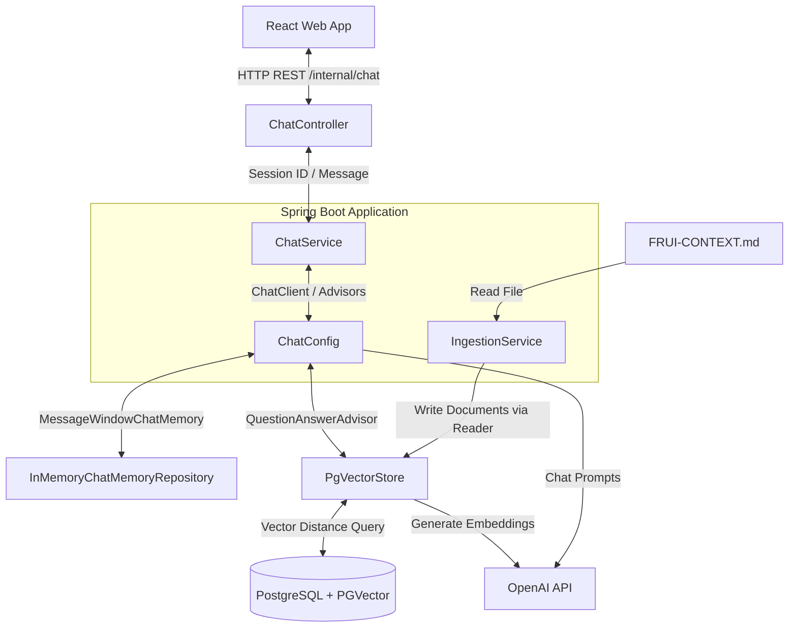
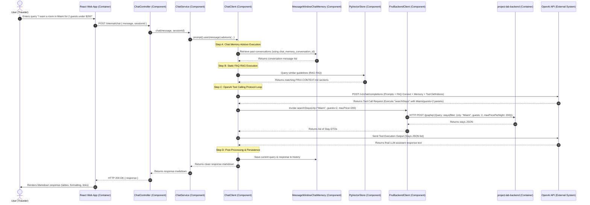

# Frui Chatbot Service Documentation

This document describes the architecture, component design, data flow, and API endpoints of the Frui Chatbot Service. The service is a Spring Boot application written in Kotlin that provides a Retrieval-Augmented Generation (RAG) backend utilizing **Spring AI**, **PostgreSQL with PGVector (`pgvector/pgvector:pg16`)**, and **OpenAI**.

---

## 1. High-Level Architecture

The Frui Chatbot Service operates as the backend conversational AI engine for the Frui travel booking application. It interfaces with:

1. **React Web Frontend**: Consumes REST endpoints and renders conversational Markdown.
2. **PostgreSQL Database (`chatbot-database`)**: Acts as a high-performance vector database using the `pgvector` extension for RAG similarity searches (`PgVectorStore`).
3. **OpenAI API**: Used for generating vector embeddings (via `text-embedding-3-small`) and conducting context-stuffed chat completions (via `gpt-4o`).



---

## 2. Component Design

The backend is built around SOLID principles and clean architecture boundaries, divided into the following layers:

### A. Presentation Layer (Controller)

- **[ChatController](src/main/kotlin/com/project/lab/chatbotService/controller/ChatController.kt)**: Exposes REST endpoints (`/internal/chat` and `/internal/chat/ingest`).

### B. Business Logic Layer (Services)

- **[ChatService](src/main/kotlin/com/project/lab/chatbotService/service/ChatService.kt)**: Orchestrates conversational prompts with the pre-configured `ChatClient`. Delegates retrieval, injection, and memory tracking to default client advisors.
- **[IngestionService](src/main/kotlin/com/project/lab/chatbotService/service/IngestionService.kt)**: Reads and parses the static platform guidelines (`FRUI-CONTEXT.md`) using `MarkdownDocumentReader` to split on horizontal rules and load them into the `PgVectorStore`.

### C. Configuration Layer

- **[ChatConfig](src/main/kotlin/com/project/lab/chatbotService/config/ChatConfig.kt)**: Defines central beans for:
  - `ChatMemory`: Uses a `MessageWindowChatMemory` backed by an `InMemoryChatMemoryRepository`.
  - `ChatClient`: Pre-configured with default system instructions, dynamic tools (`searchStays`, `getStayDetails`), and advisors.

### D. Domain Models & Client Layer

- **[Stay.kt DTOs](src/main/kotlin/com/project/lab/chatbotService/model/Stay.kt)**: Lightweight Kotlin data classes (DTOs) representing the `Stay`, `Host`, `Address`, `Amenity`, and `View` payload models returned by the GraphQL service.
- **[FruiBackendClient](src/main/kotlin/com/project/lab/chatbotService/client/FruiBackendClient.kt)**: GraphQL HTTP client that interacts with the backend service (`project-lab-backend`).

---

## 3. RAG Pipeline Flow (Hybrid Design)

The chatbot employs a hybrid RAG design: static FAQ guidelines are retrieved semantically via the local PGVector store, while live accommodations and stays data are dynamically resolved via tool calls to the backend service.

### Static Ingestion Phase (Guidelines & FAQ)

1. `POST /internal/chat/ingest` triggers the `IngestionService`.
2. The service reads the static `FRUI-CONTEXT.md` guidelines file.
3. The content is split into section-based document chunks.
4. The service writes these chunks to `PgVectorStore` (leveraging OpenAI's embedding API).

### Retrieval & Generation Phase

1. `POST /internal/chat` receives a query and `sessionId`.
2. `ChatService` invokes the `ChatClient`.
3. **Advisors Pipeline execution**:
   - `MessageChatMemoryAdvisor` retrieves conversation history matching the `sessionId` from memory.
   - `QuestionAnswerAdvisor` performs a vector similarity search on PostgreSQL (`spring_ai_vectors`) to retrieve relevant sections from `FRUI-CONTEXT.md` (for FAQ matching).
4. **Dynamic Tool Calling**:
   - If the user query requires listing, filtering, or fetching accommodations, the LLM requests a tool call to either `searchStays` or `getStayDetails`.
   - The client invokes `FruiBackendClient` to run the respective GraphQL query against `project-lab-backend`.
   - The returned stays data is fed back into the LLM context.
5. The LLM processes the system prompt, history, static context, and live tool data, generates a response, and stores it in conversation memory.

---

## 4. End-to-End Chat Scenario (C4 Dynamic/Sequence Flow)

The diagram below details a typical case scenario where a user asks: _"I want a room in Miami for 2 guests under $200"_. It tracks the request path across components, services, and external APIs.



---

## 5. System Guardrails & Boundaries

To preserve safety and application scope, the LLM is configured with strict instructions defined in `ChatConfig.kt` based on `FRUI-CONTEXT.md`:

1. **Technical Refusals**: Programming, bug-fixing, system design, or database-specific queries are rejected using this exact phrase:
   > "I'm sorry, but as the Frui Travel Assistant, I can only help you search for stays, check room availability, and assist with booking inquiries. I cannot solve programming or coding tasks."
2. **Unimplemented Feature Disclosures**: Flights, car rentals, and cruises are placeholders. The assistant clarifies:
   > "Currently, Frui focuses exclusively on lodging and accommodations (hotels and home rentals). Flight bookings, car rentals, and cruises are not supported at this time. I would be happy to help you find a place to stay!"
3. **No Admin/Write Mutations**: Bookings or listing alterations cannot be completed in-chat; users are directed to official interface forms.
4. **No Direct Payments**: The bot never collects payment card numbers or completes checkout transactions. It redirects the user to the checkout route (`/payment/:id`).
5. **Groundedness**: Answers must only be derived from retrieved data. If information is missing, it replies:
   > "I couldn't find details on that specific request. Please search our properties list directly or try adjusting your filters."

---

## 6. API Reference

### 1. Send Chat Message

- **Method**: `POST`
- **Path**: `/internal/chat` (Exposed on Port `8086`)
- **Request Headers**: `Content-Type: application/json`
- **Request Body**:
  ```json
  {
    "message": "Can you recommend a hotel in Miami with a pool and ocean view?",
    "sessionId": "session-unique-uuid-1234"
  }
  ```
- **Response Body**:
  ```json
  {
    "response": "Here is a hotel matching your criteria:\n\n### Miami Ocean Resort\n* **Location**: Miami, FL\n* **View**: Ocean View\n* **Amenities**: WiFi, Pool, AC\n* **Rooms Available**: Ocean Queen Room ($180/night)\n\nYou can view more details here: [/stay/5](/stay/5)"
  }
  ```

### 2. Trigger Ingestion

- **Method**: `POST`
- **Path**: `/internal/chat/ingest` (Exposed on Port `8086`)
- **Response Body**:
  ```json
  {
    "status": "success",
    "message": "Static knowledge ingestion triggered successfully."
  }
  ```

### 3. Health Check (Spring Boot Actuator)

- **Method**: `GET`
- **Path**: `/actuator/health` (Exposed on Port `8086`)
- **Response Body**:
  ```json
  {
    "status": "UP"
  }
  ```

---

## 7. Execution & Verification

### Running the Application (Local / Dockerized Stack)

The application stack is fully containerized with `pgvector/pgvector:pg16` for database storage.

1. Ensure `SPRING_AI_OPENAI_API_KEY` is exported in your environment or passed to Docker Compose.
2. Start the local stack using the sequential orchestration script:

   ```bash
   ./scripts/lift-stack.sh
   ```

3. Trigger knowledge ingestion:

   ```bash
   curl -X POST http://localhost:8086/internal/chat/ingest
   ```

4. Send a test message:

   ```bash
   curl -X POST http://localhost:8086/internal/chat \
        -H "Content-Type: application/json" \
        -d '{"message": "What is the policy for cancellation?", "sessionId": "test-session"}'
   ```

---

### Running Tests

Run unit tests locally:

```bash
./mvnw clean test -pl chatbot-service
```
