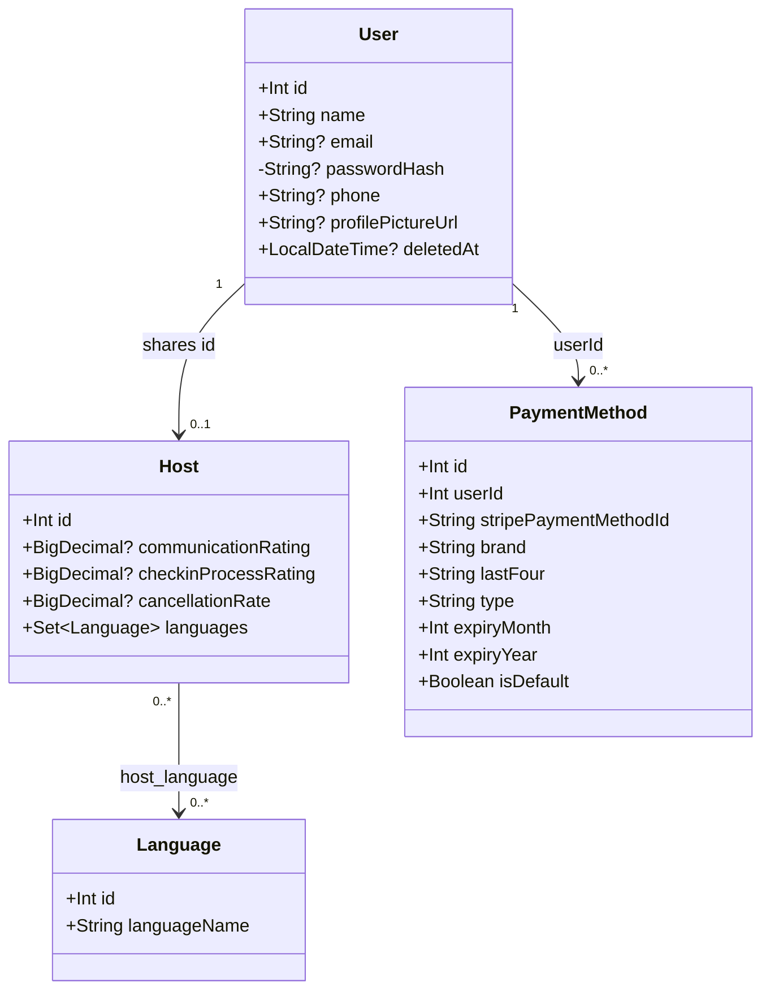
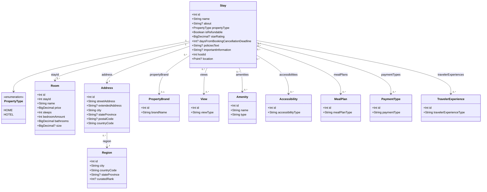
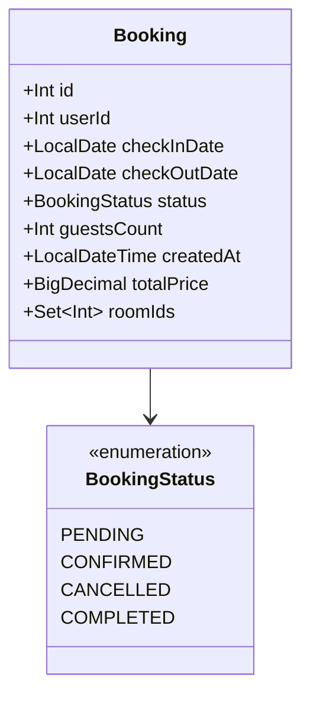
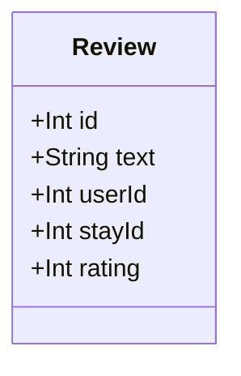
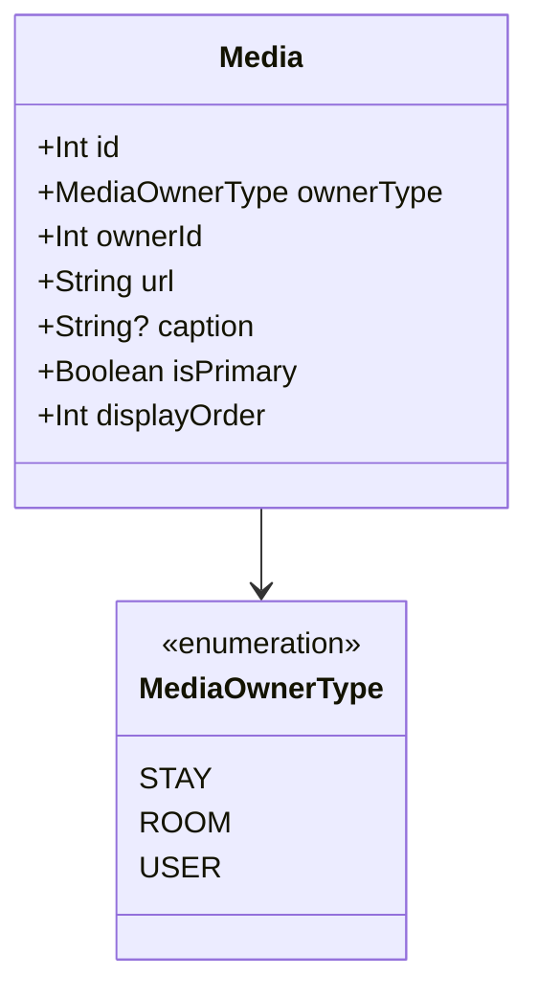

# Domain Model (Class Diagrams)

One diagram per service, reflecting the actual current JPA entity classes (`src/main/kotlin/.../models/`). Cross-service references (`hostId`, `userId`, `roomIds`, `stayId`, `ownerId`) are plain `Int`/`Set<Int>` fields, not object references — no service holds a live JPA relation into another service's tables (docs/adr/0011).

## identity-service

`User.passwordHash` is `@JsonIgnore` — never serialized. `Host.id` is not auto-generated; it's the same value as the `User.id` it subtypes.

## inventory-service

`Stay.hostId` is a plain `Int`, not a JPA relation — host existence is Feign-checked against identity-service, not joined. `Room.stayId` is likewise a plain column with a real intra-service `@ManyToOne`-style FK, unlike `hostId`. `Address.region` is a real `@ManyToOne` (docs/adr/0018) — the stable identifier for a (city, country_code) pair, resolved or created by `StayService.findOrCreateRegion()`.

## booking-service

`userId` and `roomIds` are plain `Int`/`Set<Int>` — no `User` or `Room` class exists in this service at all. `roomIds` is an `@ElementCollection` backed by the `booking_room` table, not an object graph.

## review-service

Single entity, no relations — `userId`/`stayId` are plain columns.

## media-service

One polymorphic entity for all picture ownership (`ownerType` + `ownerId`) — replaces the old monolith's separate `StayPicture`/`RoomPicture` classes (docs/adr/0003).
