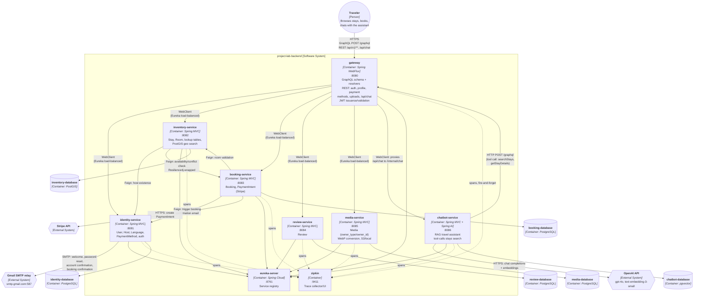
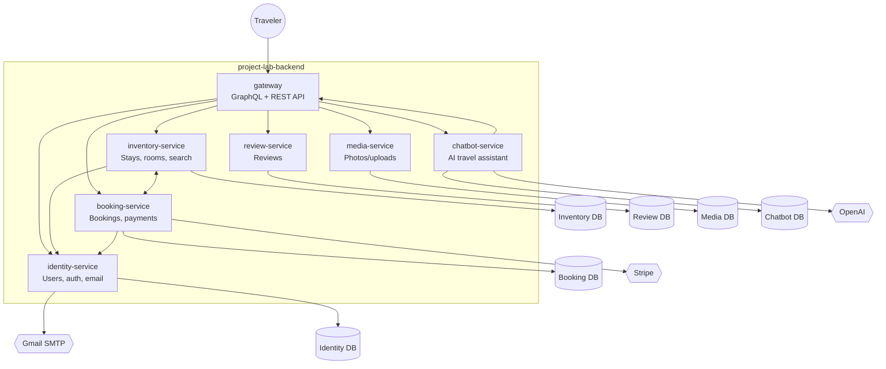

# Container Diagram (C4 Level 2)

Reflects the current microservices topology (docs/adr/0001, 0004, 0005, 0006, 0008, 0011, 0013, 0025). One box per running container in `docker-compose.yml`. Follows [C4 container-diagram conventions](https://c4model.com/diagrams/container): people as rounded/person shapes outside the system boundary, containers grouped inside a single system boundary, databases as distinct cylinder shapes, and external systems visually distinguished from containers we own.

## Legend

| Shape | Meaning |
|---|---|
| Rounded/person node | Person (actor outside the system) |
| Rectangle inside `SystemBoundary` | Container we own (a deployable/runnable unit) |
| Cylinder | Database container |
| Hexagon | External System (third-party, outside our deploy) |
| Solid arrow | Synchronous call (HTTP/GraphQL/REST) |
| Dashed arrow | Fire-and-forget / async (trace export) |

## Notes

- No inter-service call has a database-level FK across the boundary (docs/adr/0011) — every cross-service reference (`hostId`, `userId`, `roomIds`, `stayId`, `ownerId`) is either validated at write time or trusted from an authenticated JWT, never enforced by Postgres.
- `eureka-server` and `zipkin` are infrastructure, not domain services — no application traffic to/from them, only registration heartbeats and span export respectively.
- `zipkin` export is explicitly not in any service's `depends_on` — a slow/absent Zipkin must never block app startup or requests.
- `inventory-service → booking-service` is the only Resilience4j circuit-breaker-wrapped call (docs/adr/0010); on failure it falls back to a permissive "show all rooms" result rather than erroring.
- **Gateway vs. domain services use different call mechanisms.** Since the WebFlux migration (docs/adr/0025), `gateway`'s outbound calls (`*FeignClient` classes — the name is a holdover, not a hint at the implementation) go through a per-service, Eureka-resolved `WebClient` bean, not Feign. `identity-service`, `inventory-service`, `booking-service`, `review-service`, and `media-service` remain blocking Spring MVC and still use real `@FeignClient`s for the few calls between them (inventory↔booking, inventory→identity, booking→identity).
- `chatbot-service` is a RAG assistant (Spring AI): it embeds and stores `FRUI-CONTEXT.md` guideline chunks in `chatbot-database` (pgvector) for static FAQ retrieval, and calls back into `gateway`'s public GraphQL API as a tool-call for live stay/availability data — the only container that calls `gateway` rather than being called by it. `SPRING_AI_OPENAI_API_KEY` gates both chat completions and embeddings.
- `booking-service` integrates real Stripe (`StripeClient`, `PaymentIntentService`) for `PaymentIntent` creation on the booking checkout path — a separate concern from `identity-service`'s `PaymentMethod` storage, which stays fully mocked (`pm_mock_<uuid>`, no real Stripe token) since there's no client-side Stripe Elements integration yet.
- `identity-service` owns all outbound email (`EmailService`, real `JavaMailSender` over Gmail SMTP) — welcome, password reset, and account confirmation emails are triggered internally by `AuthService`, while booking confirmation is triggered cross-service: `booking-service` calls identity-service's internal `POST /internal/emails/booking-confirmation` via Feign after a successful booking.
- `gateway` enforces a per-caller rate limit (in-memory Bucket4j token bucket, keyed by authenticated user id or client IP) before a request reaches any resolver — not shown as a separate node since it's an internal filter, not a container of its own.
- `project-lab-database` is a **leftover from the pre-microservices monolith** (docs/adr/0011): `gateway` has no datasource/JPA/Flyway dependency at all (checked `gateway/pom.xml` and `application.properties` — neither mentions Postgres), yet `docker-compose.yml` still builds, starts, and `depends_on`-gates the gateway container on it. It's dead infrastructure kept alive by compose wiring, not an active data store — worth removing in a future cleanup pass rather than something to design around.

## Appendix: simplified view

The same topology with service discovery/tracing infrastructure (`eureka-server`, `zipkin`) and their edges removed, and node/edge labels trimmed to one line — useful for a quick orientation pass rather than the full picture above.

