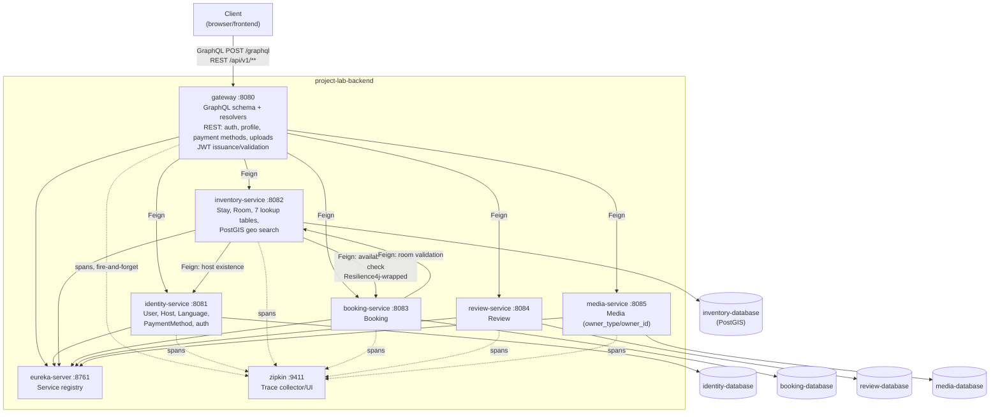

# Container Diagram (C4 Level 2)

Reflects the current microservices topology (docs/adr/0001, 0004, 0005, 0006, 0008, 0011, 0013). One box per running container in `docker-compose.yml`.

## Notes

- No inter-service call has a database-level FK across the boundary (docs/adr/0011) — every cross-service reference (`hostId`, `userId`, `roomIds`, `stayId`, `ownerId`) is either Feign-validated at write time or trusted from an authenticated JWT, never enforced by Postgres.
- `eureka-server` and `zipkin` are infrastructure, not domain services — no Feign traffic to/from them, only registration heartbeats and span export respectively.
- `zipkin` export is explicitly not in any service's `depends_on` — a slow/absent Zipkin must never block app startup or requests.
- `inventory-service → booking-service` is the only Resilience4j circuit-breaker-wrapped call (docs/adr/0010); on failure it falls back to a permissive "show all rooms" result rather than erroring.
