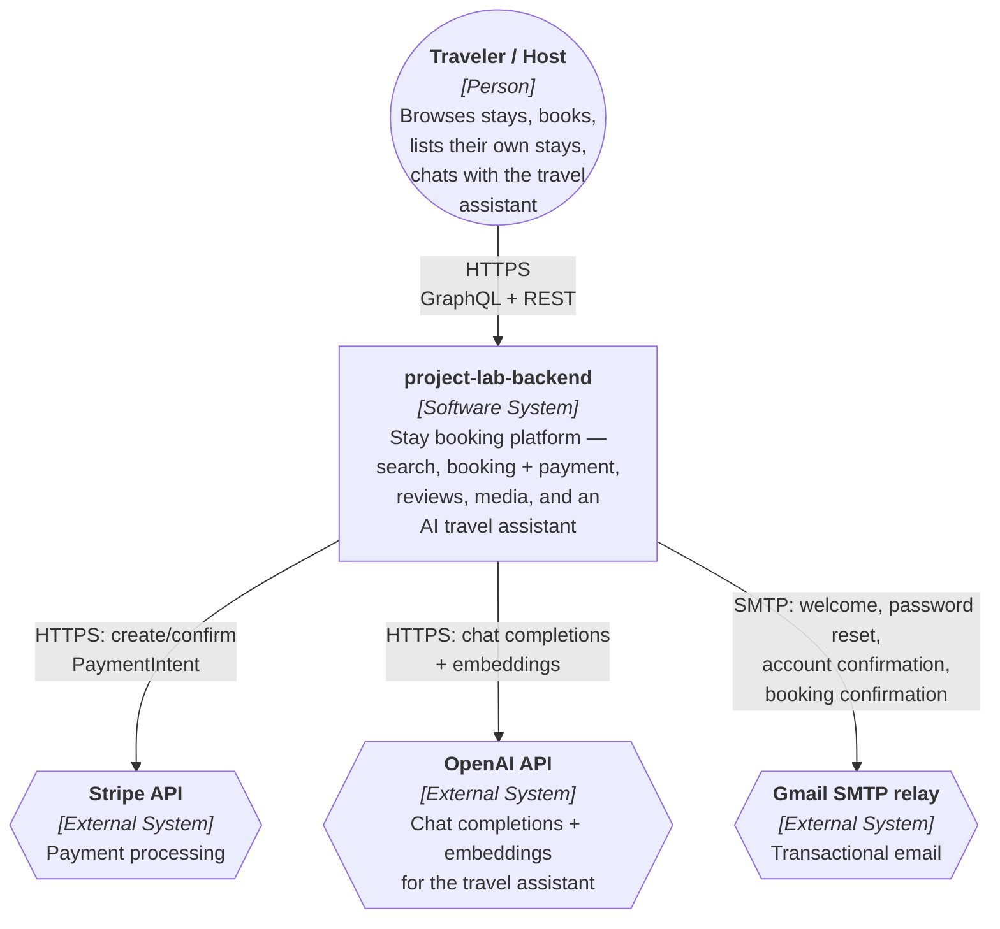

# System Context Diagram (C4 Level 1)

The outermost view: `project-lab-backend` as a single system, its one class of user,
and the external systems it depends on. See `docs/container-diagram.md` (C4 Level 2)
for the 8-container/6-database breakdown this box collapses. Follows [C4
system-context-diagram conventions](https://c4model.com/diagrams/system-context):
people as rounded/person shapes, the system in scope as a single box, external
systems visually distinguished from it.

## Legend

| Shape | Meaning |
|---|---|
| Rounded/person node | Person (actor outside the system) |
| Rectangle | The system in scope — everything in `docs/container-diagram.md` |
| Hexagon | External System (third-party, outside our deploy) |
| Solid arrow | Synchronous call (HTTP-based) |

## Notes

- One person type: `Traveler` and `Host` are the same underlying `User` (docs/adr/0002 — `Host.id` *is* `User.id`), distinguished by what they do with the platform, not by a separate account type or login.
- The frontend web app isn't modeled as a separate system here, matching `docs/container-diagram.md`'s own convention of showing the person's HTTPS traffic terminating directly at the backend — this repo doesn't own or document the frontend's internals.
- All three external systems are called from inside the system boundary, never directly by the Person: Stripe from `booking-service`, OpenAI from `chatbot-service`, and Gmail SMTP from `identity-service` (see `docs/container-diagram.md` for exactly which container calls which).
- This diagram changes only when a new external dependency is added or removed, or when the system's one-sentence purpose changes — internal re-decomposition (services split, merged, renamed) is a Level 2 concern and belongs in `docs/container-diagram.md` instead.
