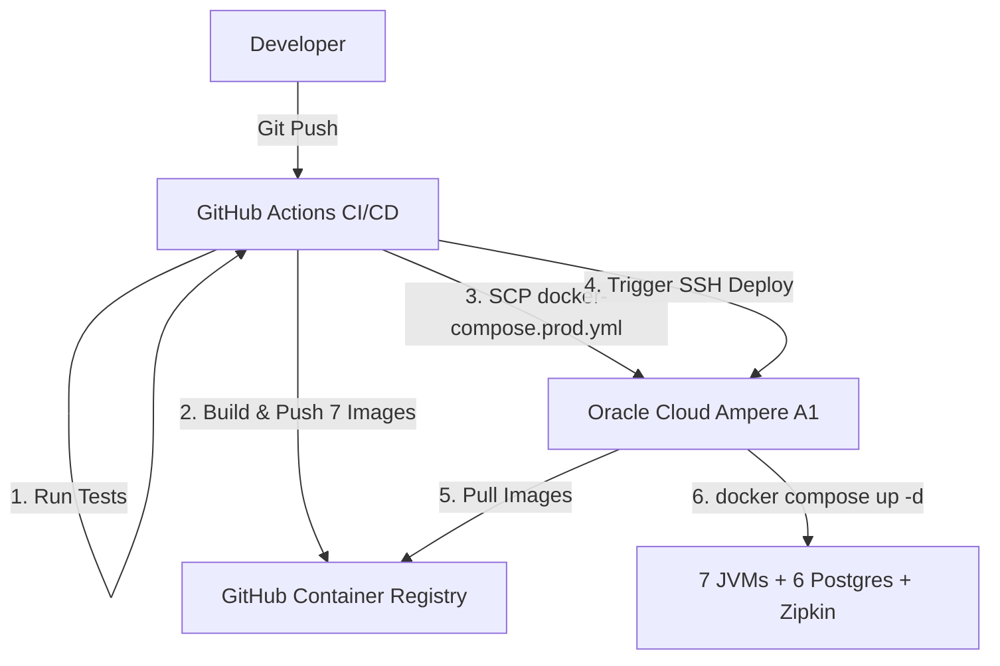

# Oracle Cloud Backend Deployment Documentation

This document describes the infrastructure and CI/CD workflow for deploying the
microservices backend to Oracle Cloud Infrastructure's Always Free tier, per
[ADR-0014](adr/0014-deployment-topology-oracle-cloud.md). It supersedes
[`docs/aws-deployment.md`](aws-deployment.md) — see that file's own banner for why.

> **Provisioning status**: this document specifies the target configuration; no
> Ampere A1 instance has actually been provisioned yet as of this migration
> phase. Values like the instance's public IP are left as placeholders
> (`<ORACLE_HOST>`) rather than invented — fill them in once the instance exists,
> the same way `docs/aws-deployment.md` recorded the real values only after its
> EC2 box was created.

---

## Architecture Overview



As with the previous AWS setup, builds are fully offloaded to GitHub Actions —
the Oracle Cloud instance only pulls pre-built images and runs them. This
matters more here than it did on the old single-JVM EC2 box: compiling seven
Kotlin/Maven modules on the same host that's also expected to run all 14
containers would contend for the same 12GB/2-OCPU budget the running stack
needs.

---

## 1. GitHub Container Registry (GHCR)

Replaces Amazon ECR. One image per Maven module (seven total: `eureka-server`,
`gateway`, `identity-service`, `inventory-service`, `booking-service`,
`review-service`, `media-service` — the plan text for this phase said "six
images instead of one," undercounting `eureka-server`; Eureka needs its own
deployable image too, since ADR-0014 explicitly runs it as part of the Compose
stack, not just the five domain services and Gateway).

- **Registry:** `ghcr.io`
- **Image naming:** `ghcr.io/<owner>/<repo>-<module>` (lowercased — GHCR
  rejects uppercase image names; the workflow lowercases `github.repository`
  before using it), e.g. `ghcr.io/russel-iv/project-lab-backend-gateway`.
- **Auth:** the `GITHUB_TOKEN` GitHub Actions provides automatically, scoped to
  `packages: write` in the workflow's `permissions:` block — no separate
  registry credentials to provision or rotate, unlike ECR's IAM access key
  pair. The deploy step also uses this same token (passed through as
  `GHCR_TOKEN`) to `docker login` on the Oracle host, so it can `docker compose
  pull` the images the build job just pushed.
- **Tags:** every image is pushed as both `:<commit-sha>` (what
  `docker-compose.prod.yml` actually deploys, via `IMAGE_TAG`) and `:latest`
  (convenience only, not deployed).

---

## 2. Oracle Cloud Infrastructure (Ampere A1, Always Free)

### Host Machine Specifications

- **Shape:** VM.Standard.A1.Flex (Ampere A1)
- **Allocation:** 2 OCPUs, 12GB RAM, Always Free (not a time-limited trial —
  per ADR-0014, this changed from the previous 4 OCPU/24GB allocation as of a
  June 2026 tier change)
- **Operating System:** Ubuntu 24.04 LTS (aarch64 — Ampere is ARM64, not x86;
  unlike the old `t3.micro` EC2 box, image pulls must be ARM64-compatible.
  `postgres:16`, `postgis/postgis:16-3.4`, and `openzipkin/zipkin` all publish
  multi-arch manifests, so no image substitution is needed there. This repo's
  own seven images are built for `linux/arm64` in
  `.github/workflows/deploy.yml`, via `docker/setup-qemu-action` +
  `docker/setup-buildx-action` on the (amd64) GitHub-hosted runner — simply
  copying the old EC2 workflow's `linux/amd64` platform pin forward would have
  silently produced images this host can't run at all. Both base images each
  module's `Dockerfile` uses (`maven:3.9.9-eclipse-temurin-24`,
  `eclipse-temurin:24-jre`) publish official arm64 manifests, so no Dockerfile
  changes were needed beyond the workflow's build platform.
- **Storage:** up to 200GB Always Free block storage (boot volume + a data
  volume for the six Postgres containers' bind-mounted volumes and the shared
  `uploads` volume)

### Security List / Network Security Group

Inbound rules (mirrors the old EC2 security group's shape, same two ports —
everything else runs on the Docker-internal network and is never exposed to
the public internet):

| Port | Protocol | Source | Purpose |
|---|---|---|---|
| 22 | TCP | `0.0.0.0/0` (or restrict to GitHub Actions' published IP ranges, if tightening) | SSH — GitHub Actions deploy step, manual administration |
| 8080 | TCP | `0.0.0.0/0` | Gateway — the only service the public ever reaches |

Ports 8761 (Eureka dashboard), 9411 (Zipkin UI), and every per-service port
(8081–8085) are exposed in `docker-compose.prod.yml` for convenience during
setup/debugging over an SSH tunnel, but should **not** be opened in the
security list for public access — they're operational/observability surfaces,
not part of the public API contract (mirrors `docs/aws-deployment.md`'s RDS
security group, which restricted database access to the EC2 instance only).

### Host System Tuning & Prerequisites

1. **Docker & Docker Compose plugin:**
   ```bash
   sudo apt update && sudo apt upgrade -y
   sudo apt install -y docker.io docker-compose-plugin
   sudo systemctl enable --now docker
   sudo usermod -aG docker ubuntu
   newgrp docker
   ```
2. **No swapfile needed** the way the old 1GB EC2 box required one — 12GB with
   the per-container `mem_limit` budget documented in
   `docker-compose.prod.yml`'s header comment leaves ~2.25GB of headroom for
   the host OS and Docker daemon without relying on swap. A small swapfile
   (1-2GB) is still cheap insurance against a runaway container, but isn't
   load-bearing the way it was on the 1GB box.
3. **Working directory:** `~/project-lab-backend/` on the host, containing
   only `docker-compose.prod.yml` (copied there by the deploy workflow's SCP
   step) and a hand-created `.env` file (see below, never committed to git or
   copied by CI).

### Required host-side `.env` file (not committed, created once manually)

`docker-compose.prod.yml` reads these from the shell environment the deploy
script exports (see workflow below) — `POSTGRES_*`/`JWT_SECRET`/
`CORS_ALLOWED_ORIGINS` come from GitHub Actions secrets at deploy time, but
`GHCR_NAMESPACE` is host-local config that doesn't change per-deploy:

```bash
# ~/project-lab-backend/.env
GHCR_NAMESPACE=<owner>/<repo>   # e.g. russel-iv/project-lab-backend, lowercased
```

---

## 3. GitHub Actions CI/CD Pipeline

The workflow lives at
[`.github/workflows/deploy.yml`](../.github/workflows/deploy.yml).

### Pipeline Stages

1. **Test:** full Maven reactor test suite (`./mvnw test`) across all seven
   modules.
2. **Build & Push (matrix, one job per module):** builds each module's
   `Dockerfile` (repo-root build context, per the existing multi-module
   pattern) and pushes to GHCR, tagged with both the commit SHA and `latest`.
3. **Deploy:**
   - Copies `docker-compose.prod.yml` to the Oracle host via SCP (so the
     deployed compose file always matches the commit being deployed, not a
     stale hand-copied version).
   - SSHes in, logs into GHCR, `docker compose pull`s the freshly-pushed
     images, and `docker compose up -d`s the stack.
   - Prunes dangling images (bounds disk usage across repeated deploys).
   - Polls the Gateway's `/actuator/health` endpoint for up to 60 seconds to
     confirm the deploy actually came up before declaring success.

### Required GitHub Actions Secrets

| Secret Name | Description |
|---|---|
| `ORACLE_HOST` | Public IP/DNS of the Ampere A1 instance |
| `ORACLE_USER` | SSH user (`ubuntu`, matching the Ubuntu 24.04 image default) |
| `ORACLE_SSH_KEY` | Private key matching a public key registered on the instance |
| `POSTGRES_USER` | Shared Postgres username across all six database containers |
| `POSTGRES_PASSWORD` | Shared Postgres password |
| `POSTGRES_DB` | Shared default database name |
| `JWT_SECRET` | Signing secret `identity-service` issues tokens with and every other service validates them against |
| `CORS_ALLOWED_ORIGINS` | Frontend origin(s) allowed to call the Gateway |

`GITHUB_TOKEN` (GHCR auth) is provided automatically by GitHub Actions and
needs no manual secret — only the `packages: write` permission declared in the
workflow file.

### JVM Memory Management

Per-container `mem_limit` (a real cgroup memory limit) plus
`-XX:MaxRAMPercentage=70.0` on every JVM — see `docker-compose.prod.yml`'s
header comment for the full 12GB budget breakdown. This differs from the old
EC2 setup in one important way: with **one** JVM on a 1GB box,
`-XX:MaxRAMPercentage` alone was enough, because the JVM's view of "total
memory" was the whole host. With **seven** JVMs sharing one 12GB host, each
container needs its own `mem_limit` too, or every JVM computes its percentage
against the full 12GB and the budget stops meaning anything.

---

## Migration Notes (from `docs/aws-deployment.md`)

- RDS is gone; each service now runs its own Postgres container (self-managed
  — backups/upgrades/patching are no longer AWS's responsibility, an accepted
  trade-off per ADR-0014).
- The AWS IAM-role-based ECR pull convenience has no Oracle Cloud equivalent;
  replaced with `GITHUB_TOKEN`-based GHCR auth, which is arguably simpler (no
  IAM role/instance profile to provision).
- The single `spring-backend` container becomes 14 containers (7 JVMs + 6
  Postgres + Zipkin); `docker run` becomes `docker compose`.
