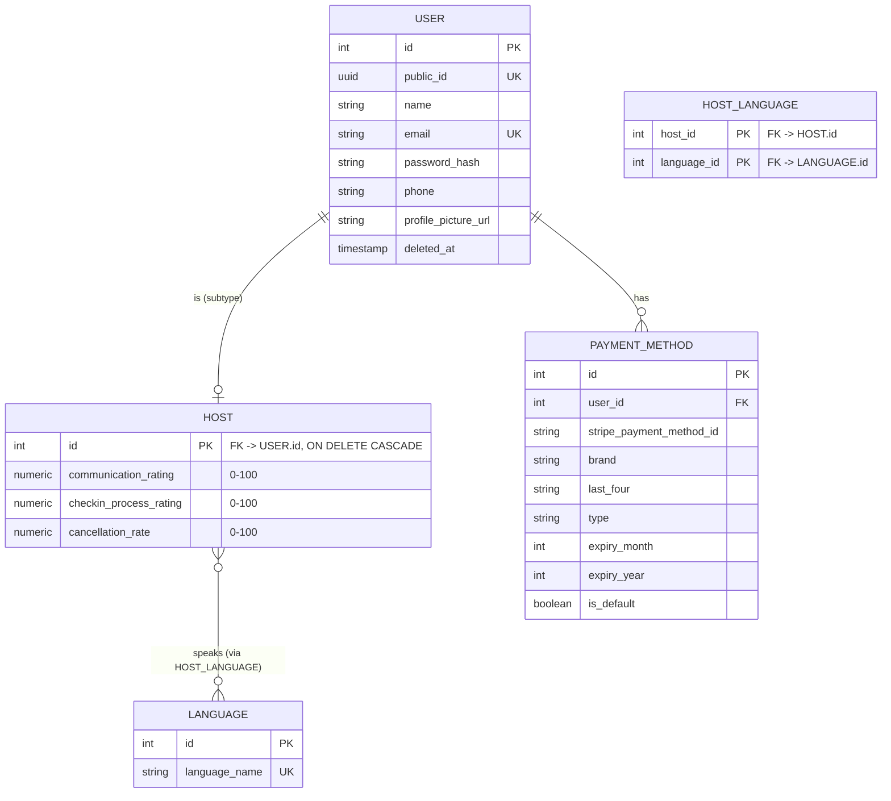
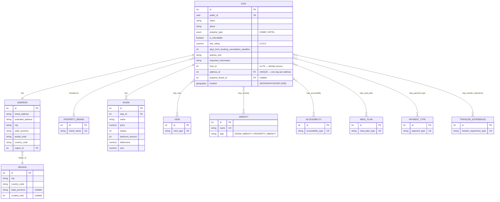
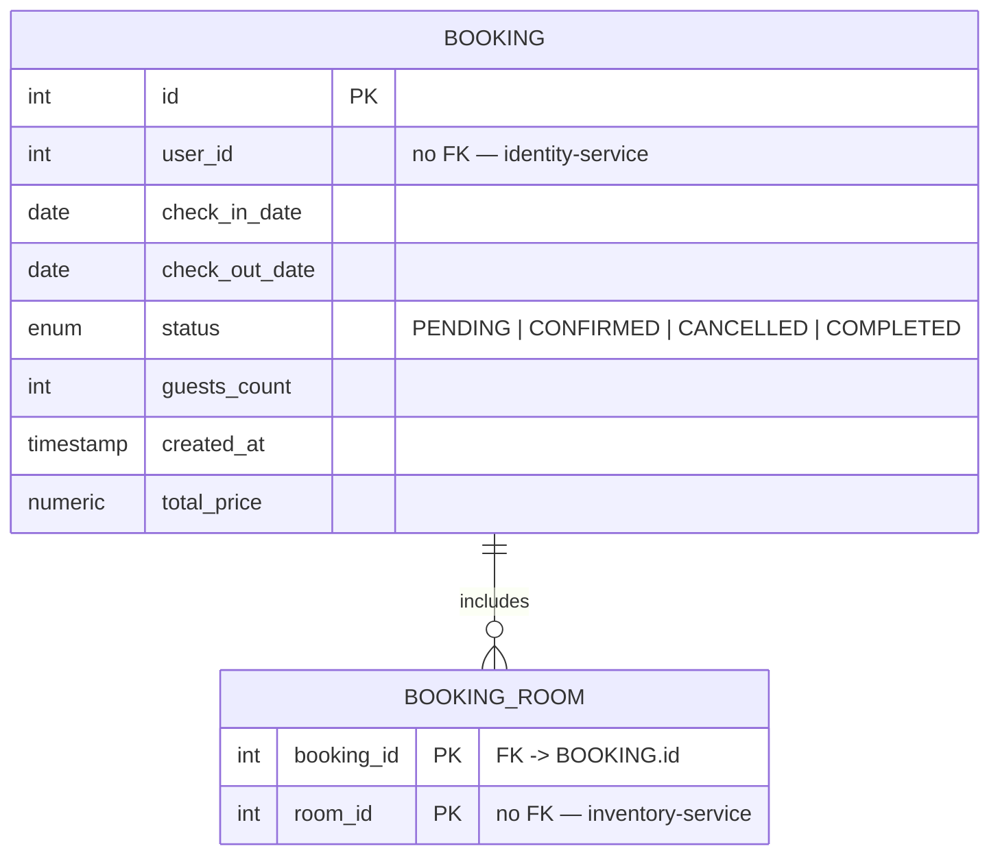
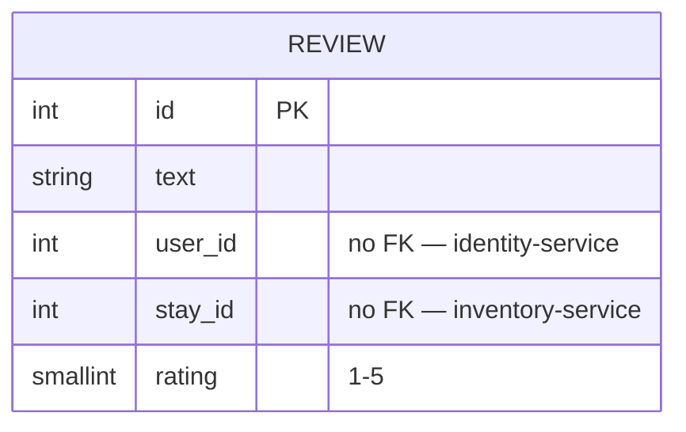
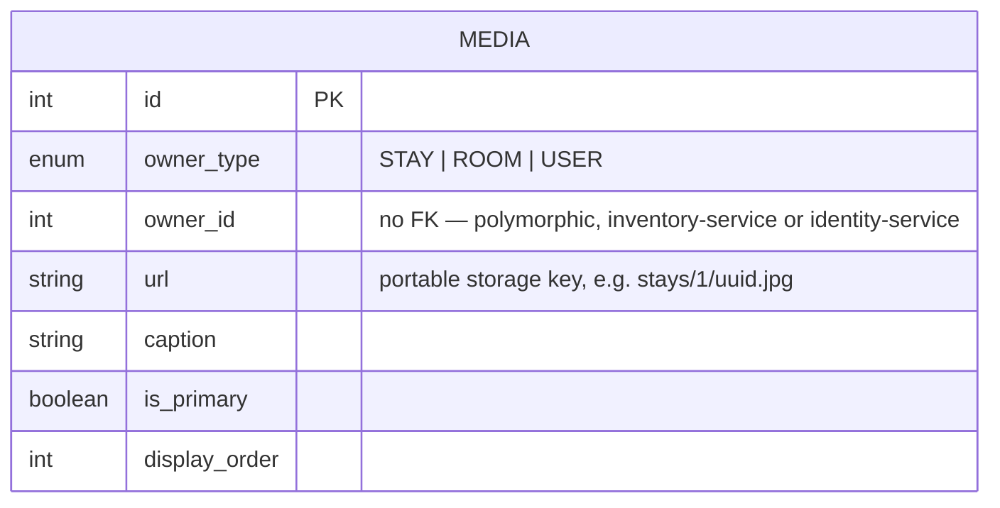

# Database Schema

One section per service (docs/adr/0011 — database-per-service). Generated from each service's own `src/main/resources/db/migration/V1__*.sql`. No FK crosses a service boundary — cross-service id references (`hostId`, `userId`, `roomIds`, `stayId`, `ownerId`) are noted per section but not drawn as ERD relationships, since nothing at the database level enforces them.

## gateway (`project-lab-database`)

No domain tables — everything was dropped by `V18`–`V22__drop_*.sql` during the migration (docs/adr/0001 and on). The Postgres connection is retained only because Flyway/JDBC config hasn't been removed from the module.

## identity-service (`identity-database`)

`email` is unique only among non-soft-deleted rows (`deleted_at IS NULL`). No raw card number/CVV is ever persisted (docs/adr — payment methods are mocked-Stripe, see CLAUDE.md).

## inventory-service (`inventory-database`, PostGIS)

`STAY.host_id` has no FK — resolved via Feign to identity-service's `Host`/`User`. `amenity.type` is a plain `VARCHAR`, not the `amenity_type` enum (kept as free-form string for `ROOM_AMENITY`/`PROPERTY_AMENITY` values). `location` is GIST-indexed for geo search. `ADDRESS.city` is GIN-indexed on `lower(city)` with `pg_trgm` (`idx_address_city_trgm`, docs/adr/0019) to accelerate substring/fuzzy destination search; the `pg_trgm` and `unaccent` extensions are enabled for this purpose.

`REGION` is the stable dedup key for a (city, country_code) pair (docs/adr/0018) — one row per distinct pair, unique-indexed on `(lower(city), country_code)`. `Address.region_id` is resolved/created by `StayService.findOrCreateRegion()` from the free-text city/country on write, not supplied directly by API callers. `destinations`/`StayFilterInput.regionId` read/filter against `region` directly rather than re-deriving distinct pairs from `address` on every call. `curated_rank` (docs/adr/0022) is a manually-assigned editorial ranking for `popularDestinations`'s empty-query state — null means "not curated"; there's no admin/host-facing way to set it yet, by design.

## booking-service (`booking-database`)

`check_out_date > check_in_date` and `guests_count > 0` are DB-level `CHECK` constraints. `BOOKING_ROOM.room_id` has no FK to inventory-service's `Room` — validated via Feign at `createBooking` time instead.

## review-service (`review-database`)

`UNIQUE(user_id, stay_id)` — one review per user per stay.

## media-service (`media-database`)

One generic table replaces the old monolith's separate `stay_picture`/`room_picture` tables (docs/adr/0003). `UNIQUE(owner_type, owner_id) WHERE is_primary` enforces one primary picture per owner.
