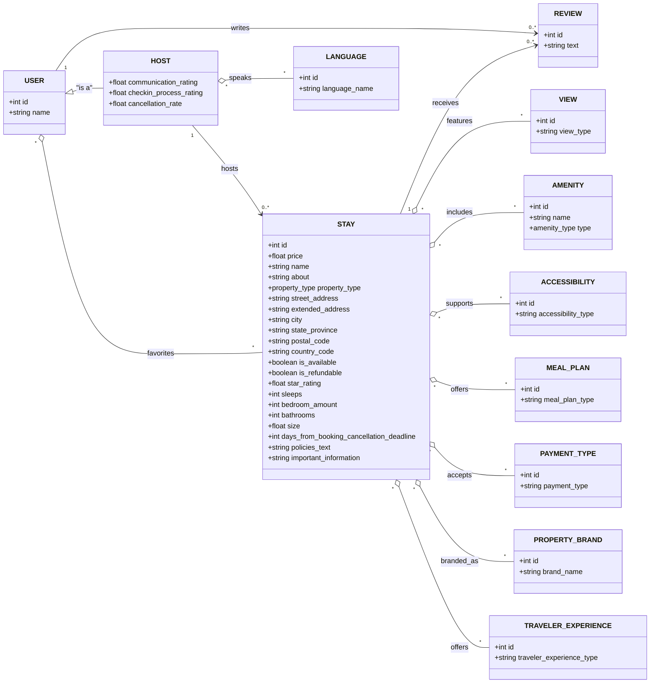

```mermaid
classDiagram
    direction LR

    %% --- Base Class ---
    class USER {
        +int id
        +string name
    }

    %% --- Subclass (Inheritance) ---
    class HOST {
        +float communication_rating
        +float checkin_process_rating
        +float cancellation_rate
    }

    class STAY {
        +int id
        +float price
        +string name
        +string about
        +property_type property_type
        +string street_address
        +string extended_address
        +string city
        +string state_province
        +string postal_code
        +string country_code
        +boolean is_available
        +boolean is_refundable
        +float star_rating
        +int sleeps
        +int bedroom_amount
        +int bathrooms
        +float size
        +int days_from_booking_cancellation_deadline
        +string policies_text
        +string important_information
    }

    class REVIEW {
        +int id
        +string text
    }

    class LANGUAGE {
        +int id
        +string language_name
    }

    class VIEW {
        +int id
        +string view_type
    }

    class AMENITY {
        +int id
        +string name
        +amenity_type type
    }

    class ACCESSIBILITY {
        +int id
        +string accessibility_type
    }

    class MEAL_PLAN {
        +int id
        +string meal_plan_type
    }

    class PAYMENT_TYPE {
        +int id
        +string payment_type
    }

    class PROPERTY_BRAND {
        +int id
        +string brand_name
    }

    class TRAVELER_EXPERIENCE {
        +int id
        +string traveler_experience_type
    }

    %% --- Inheritance Relationship ---
    USER <|-- HOST : "is a"

    %% --- Core Operational Connections ---
    HOST "1" --> "0..*" STAY : hosts
    USER "1" --> "0..*" REVIEW : writes
    STAY "1" --> "0..*" REVIEW : receives
    
    %% --- Many-to-Many Connections ---
    USER "*" o-- "*" STAY : favorites
    HOST "*" o-- "*" LANGUAGE : speaks
    STAY "*" o-- "*" VIEW : features
    STAY "*" o-- "*" AMENITY : includes
    STAY "*" o-- "*" ACCESSIBILITY : supports
    STAY "*" o-- "*" MEAL_PLAN : offers
    STAY "*" o-- "*" PAYMENT_TYPE : accepts
    STAY "*" o-- "*" PROPERTY_BRAND : branded_as
    STAY "*" o-- "*" TRAVELER_EXPERIENCE : offers
```
