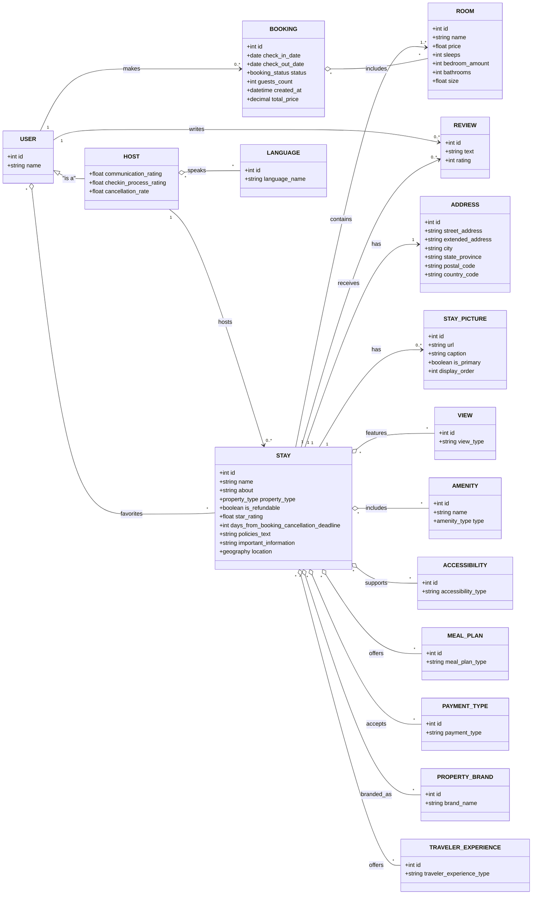

> **Superseded**: this describes the pre-migration monolithic schema. The database
> is now split one-per-service; see each service's own
> `src/main/resources/db/migration/` for the current schema
> (docs/adr/0011-database-per-service.md).

