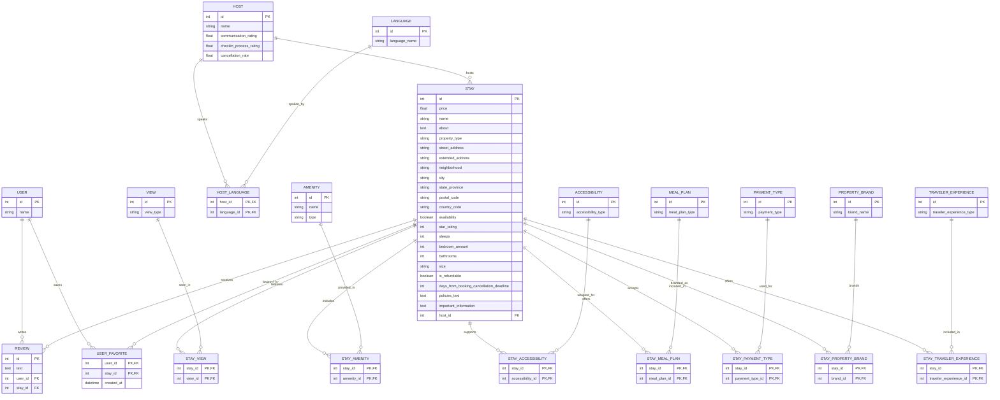

```mermaid
erDiagram
    USER {
        int id PK
        string name
    }

    HOST {
        int id PK
        string name
        float communication_rating
        float checkin_process_rating
        float cancellation_rate
    }

    STAY {
        int id PK
        float price
        string name
        text about
        string property_type
        string street_address
        string extended_address
        string neighborhood
        string city
        string state_province
        string postal_code
        string country_code
        boolean availability
        int star_rating
        int sleeps
        int bedroom_amount
        int bathrooms
        string size
        boolean is_refundable
        int days_from_booking_cancellation_deadline
        text policies_text
        text important_information
        int host_id FK
    }

    REVIEW {
        int id PK
        text text
        int user_id FK
        int stay_id FK
    }

    LANGUAGE {
        int id PK
        string language_name
    }

    HOST_LANGUAGE {
        int host_id PK, FK
        int language_id PK, FK
    }

    VIEW {
        int id PK
        string view_type
    }

    STAY_VIEW {
        int stay_id PK, FK
        int view_id PK, FK
    }

    AMENITY {
        int id PK
        string name
        string type
    }

    STAY_AMENITY {
        int stay_id PK, FK
        int amenity_id PK, FK
    }

    ACCESSIBILITY {
        int id PK
        string accessibility_type
    }

    STAY_ACCESSIBILITY {
        int stay_id PK, FK
        int accessibility_id PK, FK
    }

    MEAL_PLAN {
        int id PK
        string meal_plan_type
    }

    PROPERTY_BRAND {
        int id PK
        string brand_name
    }

    STAY_PROPERTY_BRAND {
        int stay_id PK, FK
        int brand_id PK, FK
    }

    TRAVELER_EXPERIENCE {
        int id PK
        string traveler_experience_type
    }

    STAY_TRAVELER_EXPERIENCE {
        int stay_id PK, FK
        int traveler_experience_id PK, FK
    }

    STAY_MEAL_PLAN {
        int stay_id PK, FK
        int meal_plan_id PK, FK
    }

    PAYMENT_TYPE {
        int id PK
        string payment_type
    }

    STAY_PAYMENT_TYPE {
        int stay_id PK, FK
        int payment_type_id PK, FK
    }

    USER_FAVORITE {
        int user_id PK, FK
        int stay_id PK, FK
        datetime created_at
    }

    %% Relationships (Named explicitly to fix rendering issues)
    HOST ||--o{ STAY : "hosts"
    USER ||--o{ REVIEW : "writes"
    STAY ||--o{ REVIEW : "receives"
    
    USER ||--o{ USER_FAVORITE : "saves"
    STAY ||--o{ USER_FAVORITE : "favored_by"

    HOST ||--o{ HOST_LANGUAGE : "speaks"
    LANGUAGE ||--o{ HOST_LANGUAGE : "spoken_by"
    
    STAY ||--o{ STAY_VIEW : "features"
    VIEW ||--o{ STAY_VIEW : "seen_in"
    
    STAY ||--o{ STAY_AMENITY : "includes"
    AMENITY ||--o{ STAY_AMENITY : "provided_in"

    STAY ||--o{ STAY_ACCESSIBILITY : "supports"
    ACCESSIBILITY ||--o{ STAY_ACCESSIBILITY : "adapted_for"

    STAY ||--o{ STAY_MEAL_PLAN : "offers"
    MEAL_PLAN ||--o{ STAY_MEAL_PLAN : "included_in"

    STAY ||--o{ STAY_PAYMENT_TYPE : "accepts"
    PAYMENT_TYPE ||--o{ STAY_PAYMENT_TYPE : "used_for"

    STAY ||--o{ STAY_PROPERTY_BRAND : "branded_as"
    PROPERTY_BRAND ||--o{ STAY_PROPERTY_BRAND : "brands"

    STAY ||--o{ STAY_TRAVELER_EXPERIENCE : "offers"
    TRAVELER_EXPERIENCE ||--o{ STAY_TRAVELER_EXPERIENCE : "included_in"
```
