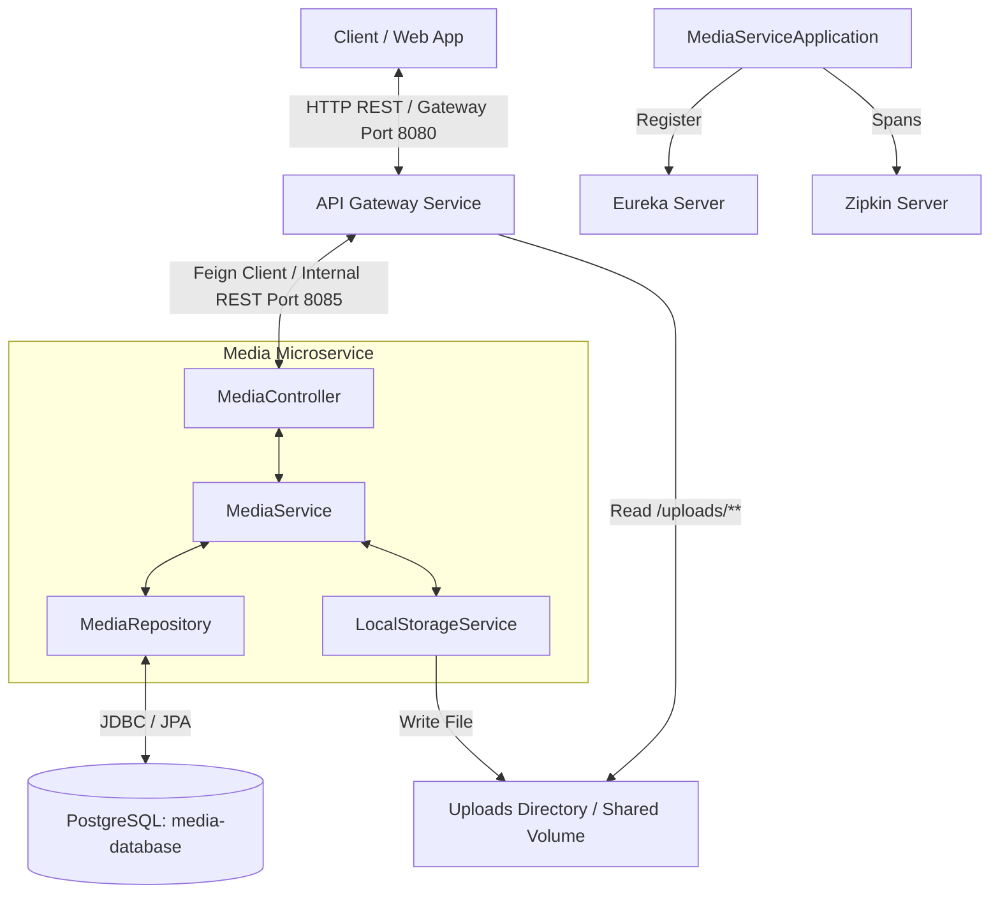
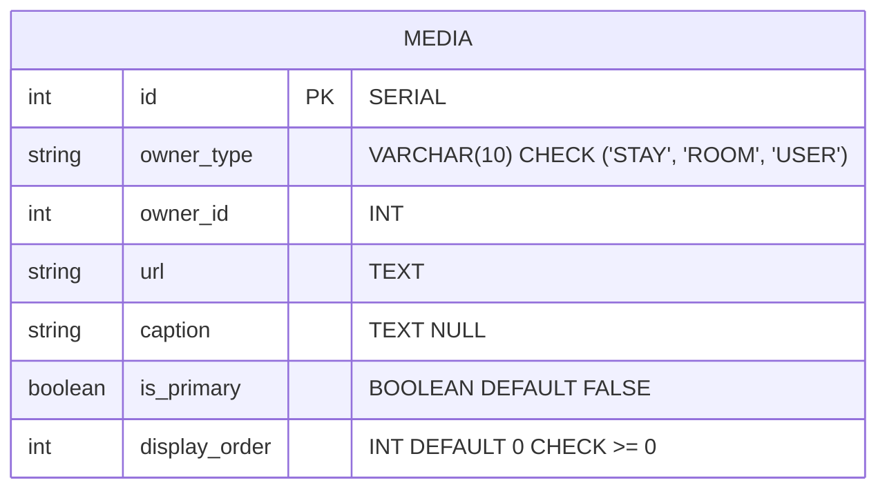
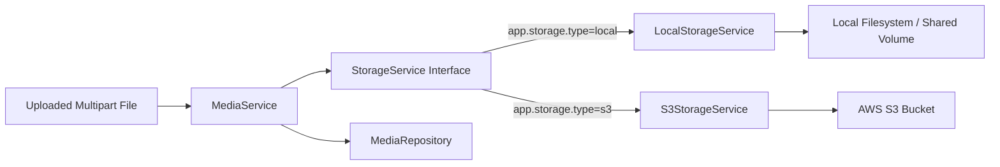
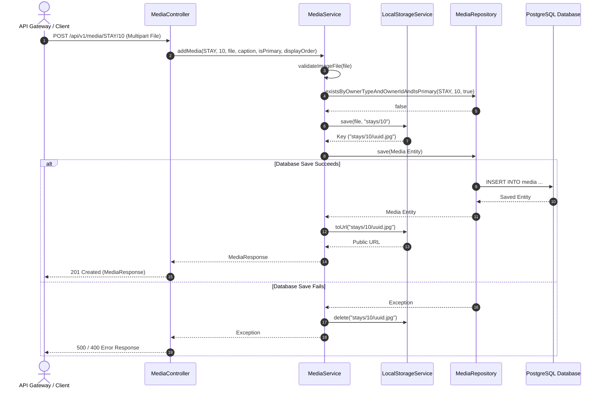
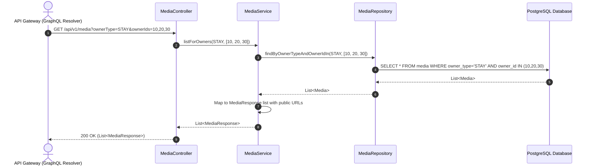
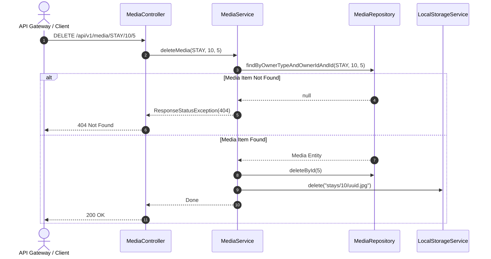

# Media Service Documentation

This document describes the architecture, component design, database model, storage strategy, and API specifications of the Frui Media Service. The service is a Spring Boot microservice written in Kotlin that provides media file storage and metadata management for platform entities such as stays, rooms, and users.

---

## 1. High-Level Architecture

The Media Service acts as the centralized media management service for the platform. It handles image upload, storage key generation, metadata persistence, and file deletion.

The service interacts with:

1. **API Gateway (`gateway`)**: Directs HTTP requests to the Media Service via OpenFeign client calls. The Gateway verifies owner identity before routing requests.
2. **PostgreSQL Database (`media-database`)**: Stores media metadata, owner mappings, primary image indicators, and display order.
3. **Shared File Storage / Volume**: Stores uploaded physical image files. The Gateway serves static uploads through its `/uploads/**` static route.
4. **Eureka Discovery Server (`eureka-server`)**: Registers the Media Service for dynamic microservice discovery.
5. **Zipkin Tracing Server**: Collects distributed trace data via OpenTelemetry and Micrometer.



---

## 2. Component Design

The service uses clean architecture principles. It separates presentation, business logic, storage abstraction, and persistence layers.

### A. Application Entry Point

- **[MediaServiceApplication.kt](project-lab-backend/media-service/src/main/kotlin/com/team1/project_lab_backend/media/MediaServiceApplication.kt)**: Initializes the Spring Boot application and enables Eureka client discovery with `@EnableDiscoveryClient`.

### B. Presentation Layer (Controller)

- **[MediaController.kt](project-lab-backend/media-service/src/main/kotlin/com/team1/project_lab_backend/media/controllers/MediaController.kt)**: Exposes REST endpoints under `/api/v1/media`. It converts input path parameters to `MediaOwnerType` enums and delegates operations to `MediaService`.

### C. Business Logic Layer (Services)

- **[MediaService.kt](project-lab-backend/media-service/src/main/kotlin/com/team1/project_lab_backend/media/services/MediaService.kt)**: Implements business logic rules. It validates image formats, enforces the single-primary image invariant per owner, manages transactional database operations, and handles file cleanup on upload failures.

### D. Storage Abstraction Layer

- **[StorageService.kt](project-lab-backend/media-service/src/main/kotlin/com/team1/project_lab_backend/media/services/StorageService.kt)**: Defines the contract interface for file operations (`save`, `delete`, `toUrl`).
- **[LocalStorageService.kt](project-lab-backend/media-service/src/main/kotlin/com/team1/project_lab_backend/media/services/LocalStorageService.kt)**: Implements `StorageService` for local filesystem storage (`app.storage.type=local`).
- **[S3StorageService.kt](project-lab-backend/media-service/src/main/kotlin/com/team1/project_lab_backend/media/services/S3StorageService.kt)**: Implements `StorageService` for AWS S3 direct backend uploads (`app.storage.type=s3`).
- **[S3Config.kt](project-lab-backend/media-service/src/main/kotlin/com/team1/project_lab_backend/media/config/S3Config.kt)**: Configures the AWS SDK v2 `S3Client` bean when S3 storage is enabled.

### E. Data Access Layer

- **[MediaRepository.kt](project-lab-backend/media-service/src/main/kotlin/com/team1/project_lab_backend/media/repositories/MediaRepository.kt)**: Extends `JpaRepository` to perform queries by owner type, owner ID, and primary status.
- **[Media.kt](project-lab-backend/media-service/src/main/kotlin/com/team1/project_lab_backend/media/models/Media.kt)**: Defines the JPA entity mapping for the `media` table and the `MediaOwnerType` enum (`STAY`, `ROOM`, `USER`).
- **[MediaDto.kt](project-lab-backend/media-service/src/main/kotlin/com/team1/project_lab_backend/media/dto/MediaDto.kt)**: Holds data transfer objects (`MediaResponse` and `UpdateMediaRequest`).

---

## 3. Database Schema & Data Models

The service uses Flyway migration script **[V1\_\_media_table.sql](project-lab-backend/media-service/src/main/resources/db/migration/V1__media_table.sql)** to manage the database structure.

### Entity Relationship Diagram



### Table Structure

| Column          | Type          | Constraints                                     | Description                                            |
| :-------------- | :------------ | :---------------------------------------------- | :----------------------------------------------------- |
| `id`            | `SERIAL`      | `PRIMARY KEY`                                   | Unique record identifier.                              |
| `owner_type`    | `VARCHAR(10)` | `NOT NULL`, `CHECK IN ('STAY', 'ROOM', 'USER')` | Entity category that owns the media item.              |
| `owner_id`      | `INT`         | `NOT NULL`                                      | Unique identifier of the owner entity.                 |
| `url`           | `TEXT`        | `NOT NULL`                                      | Relative file storage key (e.g., `stays/10/uuid.jpg`). |
| `caption`       | `TEXT`        | `NULLABLE`                                      | Optional image text caption.                           |
| `is_primary`    | `BOOLEAN`     | `NOT NULL`, `DEFAULT FALSE`                     | Flag indicating primary image for display.             |
| `display_order` | `INT`         | `NOT NULL`, `DEFAULT 0`, `CHECK >= 0`           | Ordering index for image rendering.                    |

### Database Constraints & Indexes

1. **`idx_media_owner`**: Non-unique index on `(owner_type, owner_id)` for quick lookup queries.
2. **`idx_media_primary`**: Partial unique index on `(owner_type, owner_id) WHERE is_primary = TRUE`. Enforces at most one primary image per owner at the database layer.
3. **`check_media_display_order`**: Check constraint enforcing `display_order >= 0`.

---

## 4. Storage Architecture

The service decouples media metadata handling from physical storage management.



### Storage Strategy Details

1. **Storage Abstraction**: The `StorageService` interface permits seamless switching between local disk storage (`LocalStorageService`) and AWS S3 (`S3StorageService`) via configuration property `app.storage.type`.
2. **Relative Keys**: The database stores relative storage keys (e.g., `stays/12/550e8400-e29b-41d4-a716-446655440000.jpg`).
3. **Public URL Mapping**:
   - `LocalStorageService.toUrl(key)` constructs local gateway URLs (`http://localhost:8080/uploads/stays/12/...`).
   - `S3StorageService.toUrl(key)` constructs S3 public URLs (`https://frui-media-bucket.s3.us-east-1.amazonaws.com/stays/12/...`).
4. **Failure Recovery**: If a database transaction fails after saving a file, `MediaService` catches the exception and invokes `storageService.delete(key)` to clean up the file.

---

## 5. REST API Specifications

All endpoints are relative to `/api/v1/media`.

### 1. List Media for Specific Owner

- **HTTP Method**: `GET`
- **Path**: `/{ownerType}/{ownerId}`
- **Path Variables**:
  - `ownerType`: String (`stay`, `room`, `user`).
  - `ownerId`: Integer.
- **Success Response**: `200 OK`
- **Response Body**: List of `MediaResponse` objects.

```json
[
  {
    "id": 1,
    "ownerType": "STAY",
    "ownerId": 10,
    "url": "http://localhost:8080/uploads/stays/10/a1b2c3d4.jpg",
    "caption": "Ocean view front pool",
    "isPrimary": true,
    "displayOrder": 0
  }
]
```

---

### 2. Bulk List Media for Multiple Owners

- **HTTP Method**: `GET`
- **Path**: `/`
- **Query Parameters**:
  - `ownerType`: String (`stay`, `room`, `user`).
  - `ownerIds`: List of Integers (e.g., `?ownerType=STAY&ownerIds=10,11,12`).
- **Success Response**: `200 OK`
- **Response Body**: List of `MediaResponse` objects.

---

### 3. Upload Media File

- **HTTP Method**: `POST`
- **Path**: `/{ownerType}/{ownerId}`
- **Content Type**: `multipart/form-data`
- **Form Parameters**:
  - `file`: MultipartFile (`image/jpeg`, `image/png`, `image/gif`, `image/webp`, `image/avif`).
  - `caption`: String (Optional).
  - `isPrimary`: Boolean (Default: `false`).
  - `displayOrder`: Integer (Default: `0`).
- **Success Response**: `201 Created`
- **Response Body**: Created `MediaResponse` object.

#### Validation Rules:

- The file must not be empty.
- Content type must start with `image/`.
- File extension must match allowed extensions (`jpg`, `jpeg`, `png`, `gif`, `webp`, `avif`).
- `displayOrder` must be greater than or equal to `0`.
- An owner cannot have more than one primary image.

---

### 4. Update Media Metadata

- **HTTP Method**: `PATCH`
- **Path**: `/{ownerType}/{ownerId}/{id}`
- **Request Body**: `UpdateMediaRequest` JSON object.

```json
{
  "caption": "Updated pool view",
  "isPrimary": false,
  "displayOrder": 1
}
```

- **Success Response**: `200 OK`
- **Response Body**: Updated `MediaResponse` object.

---

### 5. Delete Media

- **HTTP Method**: `DELETE`
- **Path**: `/{ownerType}/{ownerId}/{id}`
- **Success Response**: `200 OK` (No Body)
- **Side Effect**: Deletes the database record and removes the physical file from storage.

---

## 6. Key Workflows & Sequence Diagrams

### A. Media Upload Sequence with Failure Rollback

The diagram below shows file storage, metadata saving, and transactional file cleanup on failure.



---

### B. Bulk Retrieval Sequence (Gateway Batch Resolver)

The diagram below shows how the API Gateway fetches media items for multiple owner IDs in a single query.



---

### C. Media Deletion Sequence



---

## 7. Configuration & Observability

### Configuration Parameters

Central configuration resides in **[application.properties](project-lab-backend/media-service/src/main/resources/application.properties)**:

```properties
spring.application.name=media-service
server.port=8085

eureka.client.service-url.defaultZone=${EUREKA_URL:http://localhost:8761/eureka}
eureka.instance.prefer-ip-address=true

spring.datasource.url=jdbc:postgresql://${MEDIA_DB_HOST:localhost}:${MEDIA_DB_PORT:5434}/${MEDIA_DB_NAME:postgres}
spring.datasource.driverClassName=org.postgresql.Driver
spring.datasource.username=${MEDIA_DB_USER:postgres}
spring.datasource.password=${MEDIA_DB_PASSWORD:password_local}

spring.jpa.hibernate.ddl-auto=none

app.upload.dir=${UPLOAD_DIR:uploads}
app.public-url=${PUBLIC_URL:http://localhost:8080}

management.tracing.sampling.probability=1.0
management.tracing.export.zipkin.endpoint=${ZIPKIN_URL:http://localhost:9411/api/v2/spans}
logging.pattern.console=%d{HH:mm:ss.SSS} %-5level %logger{36} [%X{traceId}] - %msg%n
```

### Distributed Tracing

- Micrometer Tracing Bridge OTel (`micrometer-tracing-bridge-otel`) auto-instruments HTTP requests and database interactions.
- Zipkin exporter (`opentelemetry-exporter-zipkin`) pushes trace data to the Zipkin collector endpoint.
- Log outputs include `[traceId]` for cross-service request correlation.
